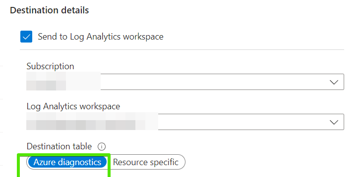
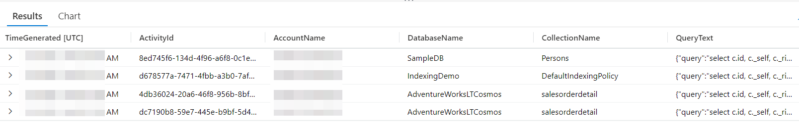
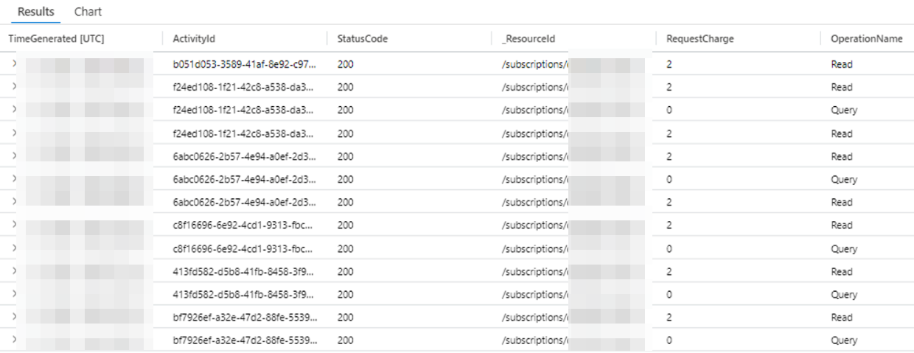
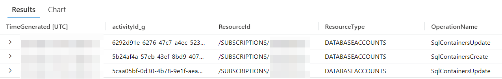

こんにちは。Cosmos DB サポートチームです。

本記事では Cosmos DB のトラブルシュートの際に必要となる情報を案内します。

問題やご相談いただく内容により必要となる情報は異なってまいりますが、今回は共通して必要となる情報について案内します。

# #基本情報

1.Subscription Id:  サブスクリプション ID

2.Cosmos DB Account 名

3.Database 名

4.Container 名

5.Cosmos DB API (NoSQL/MongoDB/Table/Gremlin/Cassandra)

6.本番環境 (Yes/No)

参考


# #エラーの情報

1. エラーが発生した場合の詳細な時間 (日本時間の場合その旨明記。もしくは UTC 時間）    2. Activity ID ならびにスタックトレース含むエラーメッセージなお、本情報は画像のみでなくテキスト形式もあわせて送付ください。 Activity ID が不明な場合、Activity ID の項目を参照ください。

3. 事象の発生頻度。また以前動作していたか。4. （お気づきの場合) エラーの発生契機

5. エラーが発生するまでの手順 毎回事象が発生する場合、エラーが発生するまでの手順を PSR で採取ください    https://support.microsoft.com/en-us/help/22878/windows-10-record-steps

6.  (可能であれば) アプリケーションからでなくポータルからの操作で同様にエラーが発生するか

# #Client ・Application 情報

1. Cosmos DB に接続しているサービス (例:  Azure Functions / Azure Web App Service / <span lang="en-US" style="background-color:white">Azure Kubernetes Service (AKS)</span> , 他)

```
*注釈問題の内容に応じて利用サービスの Subscription Id や名前などの情報を依頼することがございます。また問題によっては該当サービス観点でのお問い合わせを相談させていただくことがございます。
```

2. Cosmos DB SDK とそのバージョン情報 (.Net/.Net Core/Java/Node.js/Python 他)

3. 事象が発生する最小単位のコードおよびクエリ(内容によってはサンプルデータ)

4.  (アプリケーションで Diagnostics を取得している場合)  Diagnostics  \*SDK により取得方法異なります。

## # Activity ID

Cosmos DB に接続・操作するアプリケーションのログで Activity ID を取得していない場合、対象の Cosmos DB アカウントに対して診断設定をすることで Log Analtics から Activity ID 含む診断ログの取得が可能です。

診断ログの設定方法はhttps://learn.microsoft.com/ja-jp/azure/cosmos-db/monitor-resource-logs?tabs=azure-portalを参照ください。

下記はリクエストの種類 (Query / Data Plane / Control Plane) ならびに診断ログの設定 (Azure diagnostics or Resource specific) に応じたログ取得のクエリならびにその出力結果（サンプル）となります。

### <span style="text-decoration:underline">Query Requests</span>

| **Azure diagnostics**<br><br> | **Resource specific**<br><br> |
| --- | --- |
| AzureDiagnostics<br><br>| where ResourceProvider =="MICROSOFT.DOCUMENTDB" and Category == "QueryRuntimeStatistics"<br><br>| project TimeGenerated, activityId\_g, querytext\_s,databasename\_s,collectionname\_s,ResourceId,ResourceType,regionname\_s,authtype\_s,numberofrowsreturned\_s,queryexecutionstatus\_s,userAgent\_s,partialipaddress\_s,partitionKeyRangeId\_s<br><br><br><br><br> | CDBQueryRuntimeStatistics<br><br>|project TimeGenerated,ActivityId,AccountName,DatabaseName,CollectionName,PartitionKeyRangeId,QueryText,SourceSystem,Type,\_ResourceId<br><br><br><br><br><br> |
| <br> | <br> |

### <span style="text-decoration:underline">Data plane requests</span>

| **Azure diagnostics** | **Resource specific**  |
| --- | --- |
| AzureDiagnostics<br><br>| where ResourceProvider=="MICROSOFT.DOCUMENTDB" and Category=="DataPlaneRequests"<br><br>//| where statusCode\_s !in(200,201)<br><br>| project TimeGenerated,activityId\_g,statusCode\_s,ResourceId,requestCharge\_s,ResourceType,OperationName,requestResourceType\_s,connectionMode\_s,userAgent\_s,clientIpAddress\_s,duration\_s,requestLength\_s,responseLength\_s,regionname\_s,databasename\_s<br><br> | CDBDataPlaneRequests<br><br>| project TimeGenerated,ActivityId,StatusCode,\_ResourceId,RequestCharge,OperationName,RequestResourceType,RequestResourceId,ConnectionMode,UserAgent,ClientIpAddress,DurationMs,RequestLength,ResponseLength,RegionName,DatabaseName,CollectionName,PartitionId,KeyType,AuthTokenType<br><br> |
| <br> | <br> |

### <span style="text-decoration:underline">Control plane requests</span>

| **Azure diagnostics** | **Resource specific**  |
| --- | --- |
| AzureDiagnostics<br><br>| where ResourceProvider=="MICROSOFT.DOCUMENTDB" and Category=="ControlPlaneRequests"<br><br>| project TimeGenerated,activityId\_g,statusCode\_s,ResourceId,requestCharge\_s,ResourceType,OperationName,requestResourceType\_s,connectionMode\_s,userAgent\_s,clientIpAddress\_s,duration\_s,requestLength\_s,responseLength\_s,regionname\_s,databasename\_s | CDBControlPlaneRequests<br><br>|project TimeGenerated,ActivityId,AccountName,OperationName,OperationType,HttpStatusCode,Result,HttpMethod,ApiKind,ApiKindResourceType,ResourceUri,ResourceDetails,Type,\_ResourceId |
| <br> | <br> |

<span style="text-decoration:underline">補足</span>

上記採取情報をテキスト形式でもまとめています。(診断ログの項目除く)

必要に応じてこちらもご活用ください。

[cosmosdbbasicinformationtocollect.txt](./Cosmos-DB-basicinformationtocollect/cosmosdbbasicinformationtocollect-1-4475d98c8b694cb4b66877c4443918cb.txt)

